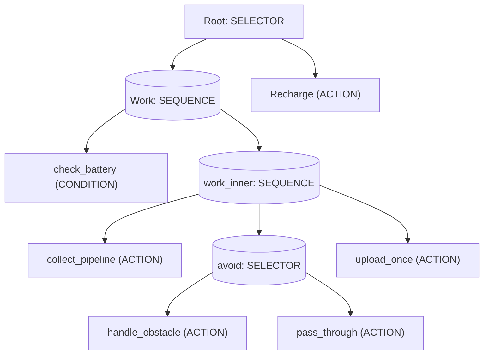
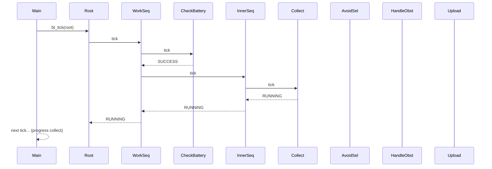

# C Behavior Tree

c-behavior-tree是一个简单的行为树（Behavior Tree, BT）实现。
本仓库也包含一个 POSIX 示例程序，用于演示黑板（blackboard）、user_data、on_enter/on_exit 钩子与时间锚（time anchor）等。

目录

- `c-behavior-tree.h`：公共 API（节点结构、状态、节点类型、初始化与 tick 接口）。
- `c-behavior-tree.c`：核心实现（ACTION / CONDITION / SEQUENCE / SELECTOR / INVERTER）。
- `bt_example_posix.c`：演示程序（POSIX）。
- `test_c-behavior-tree.c`：测试套件（已移植为 Linux 可执行）。

设计要点

- 轻量、无动态分配：节点由调用者静态分配或在栈上创建。
- 单次 tick 驱动：用户通过 `bt_tick(root)` 对树进行一次推进。
- 支持黑板与每节点 user_data，用于共享和定制行为参数。

核心概念

- 状态（bt_status_t）：
  - `BT_SUCCESS` (0)
  - `BT_FAILURE` (1)
  - `BT_RUNNING` (2)
  - `BT_ERROR` (255)

- 节点类型（bt_node_type_t）：
  - `BT_ACTION`、`BT_CONDITION`（叶子节点，由用户提供 tick 回调）
  - `BT_SEQUENCE`（顺序）
  - `BT_SELECTOR`（选择/回退）
  - `BT_INVERTER`（装饰器：反转 SUCCESS/FAILURE）

- 节点数据结构 `bt_node_t`（字段要点）：
  - `type` / `status`
  - `tick`：叶子节点的回调函数（`bt_tick_fn`）
  - `children`：`bt_node_t *const children[]`（指向子节点指针数组）
  - `children_count`：子节点数量
  - `current_child`：复合节点当前处理到的子索引（用于 RUNNING 持久化）
  - `on_enter` / `on_exit`：可选生命周期钩子
  - `time_anchor_ms`：可选时间锚（示例用于等待直到某个时刻再执行）
  - `user_data` / `blackboard`

API 使用（简要）

- 初始化节点：

  void bt_init(bt_node_t *node,
               bt_node_type_t type,
               bt_tick_fn tick_fn,
               bt_node_t *const children[],
               uint16_t children_count,
               void *user_data);

  - 当 `children_count == 0` 时，children 可传 `BT_NULL`。

- 运行一次 tick：

  bt_status_t bt_tick(bt_node_t *root);

  - 返回根节点的状态（SUCCESS/FAILURE/RUNNING/ERROR）。

行为语义（实现细节）

- SEQUENCE
  - 从 `current_child` 开始依次执行子节点。
  - 若子节点返回 `BT_RUNNING`，则记录 `current_child` 并返回 `BT_RUNNING`。
  - 若子节点返回 `BT_FAILURE`（或 `BT_ERROR`），立即返回对应终态并触发 `on_exit`。
  - 当所有子节点返回 `BT_SUCCESS` 时，Sequence 返回 `BT_SUCCESS` 并触发 `on_exit`。
  - `on_enter` 在从非 RUNNING 转为 RUNNING 时调用（仅首次进入运行）。

- SELECTOR
  - 与 Sequence 对称：尝试子节点直到有子节点返回 `BT_SUCCESS`（则 Selector 成功）。
  - 若所有子节点都返回 `BT_FAILURE`，则 Selector 返回 `BT_FAILURE`。
  - RUNNING 和 ERROR 处理同上（记录 `current_child` 并返回）。

- INVERTER
  - 仅允许 1 个子节点，`SUCCESS <-> FAILURE` 互换，`RUNNING` 与 `ERROR` 透传。

生命周期钩子与 time_anchor

- `on_enter(node)`：当复合/装饰节点首次从非运行态进入运行时调用。适合做状态初始化（示例中用于重置进度）。
- `on_exit(node)`：当节点到达终态（SUCCESS/FAILURE/ERROR）时调用。适合做清理或统计。
- `time_anchor_ms`：用户可在叶子回调里检查此字段（示例提供 `bt_time_anchor_ready()`）。当 `time_anchor_ms == 0` 表示立即可执行；否则可等待系统时间到达该 ms 值后再执行。

示例行为树

示例程序 `bt_example_posix.c` ：



运行时时序

假设电池足够：



更完整的例子参见 `bt_example_posix.c` 中注释与输出。

构建和运行

在 Linux 环境：

- 构建 demo：

```sh
gcc -std=c11 -O2 -Wall bt_example_posix.c c-behavior-tree.c -o bt_demo
./bt_demo
```


```sh
gcc -std=c11 -O2 -Wall test_c-behavior-tree.c c-behavior-tree.c -o bt_test
./bt_test         # 运行全部测试
./bt_test list    # 列出所有测试用例
./bt_test 1       # 运行索引为 1 的测试用例
./bt_test status  # 打印测试黑板/上下文
```

示例输出（来自 `bt_example_posix.c` 运行片段）

```
>> work sequence enter: reset collect_progress
[collect] progress=1/3, battery=35%
[main] tick=0 => root status=2, battery=34%
[collect] progress=2/3, battery=34%
[collect] progress=3/3, battery=33%
[collect] done.
[avoid] obstacle detected -> avoiding...
[upload] attempt #1 -> FAILURE
[recharge] charging...
[main] tick=3 => root status=0, battery=100%
```
